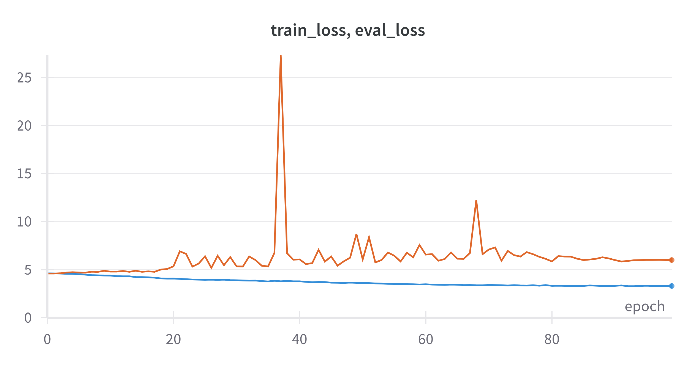
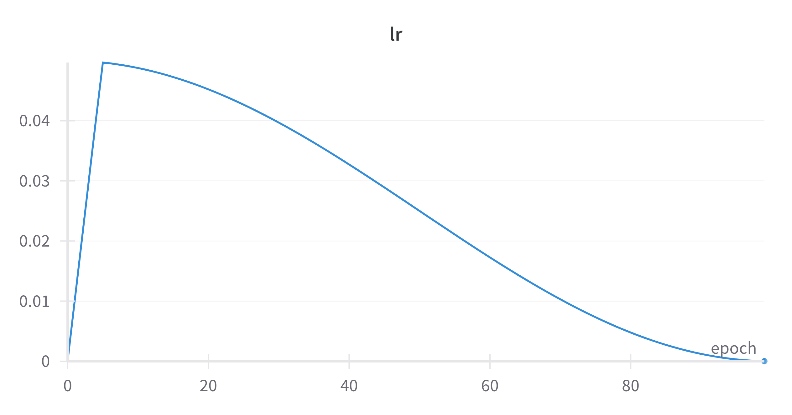
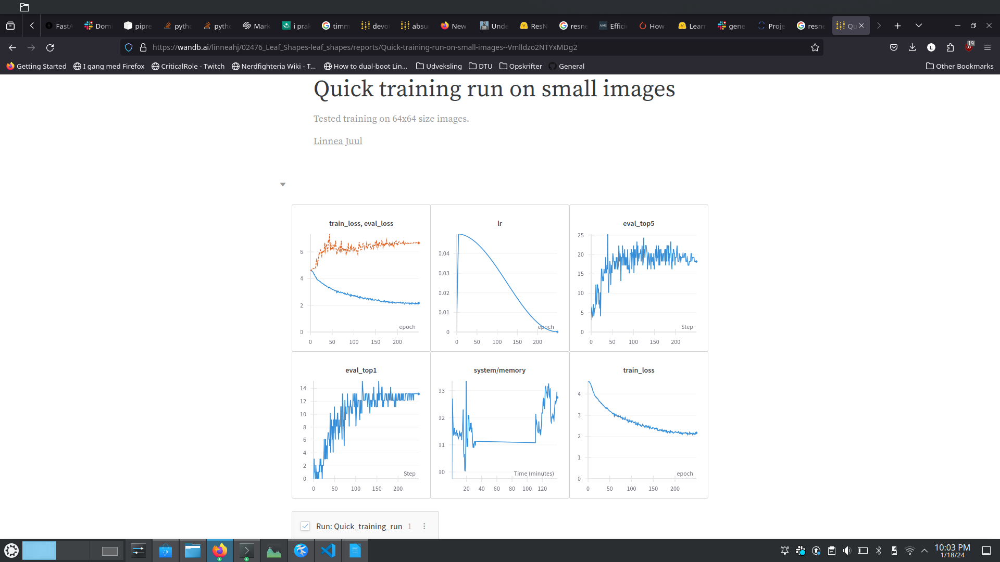
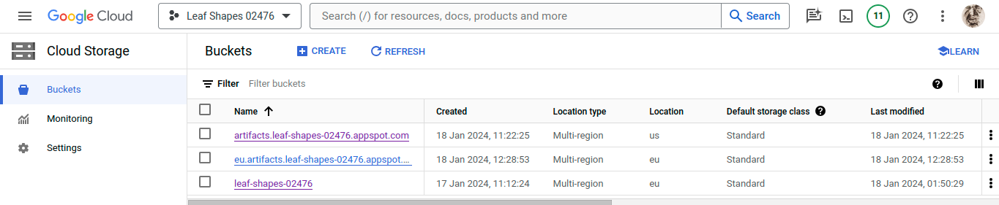
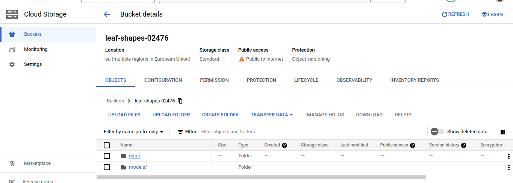
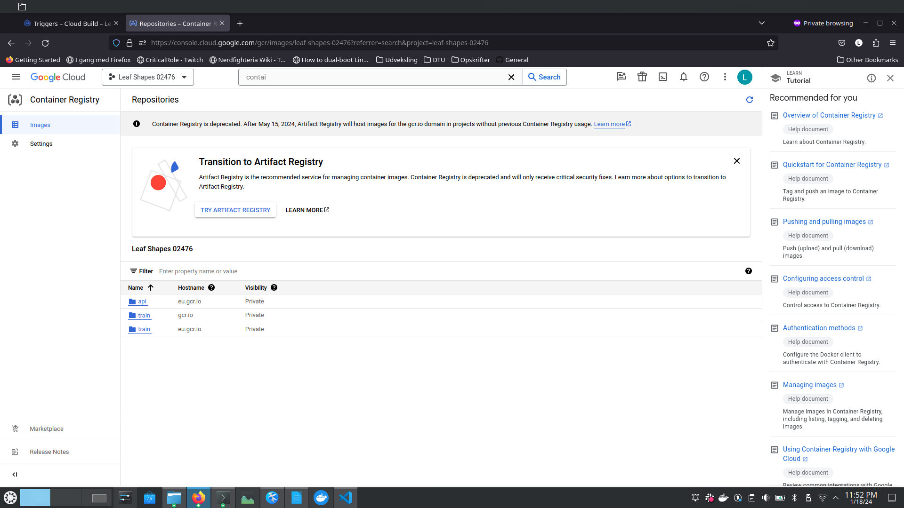
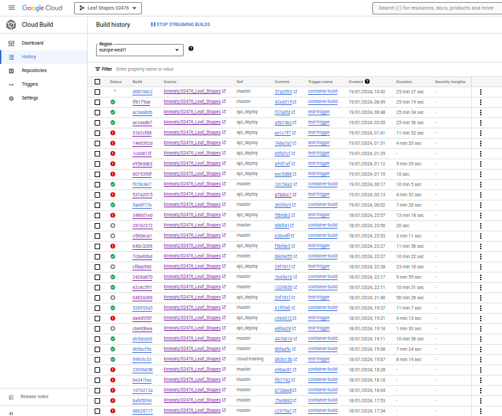
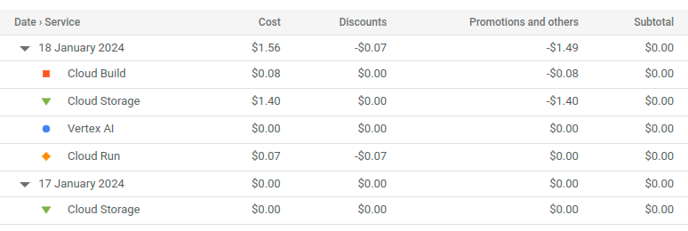
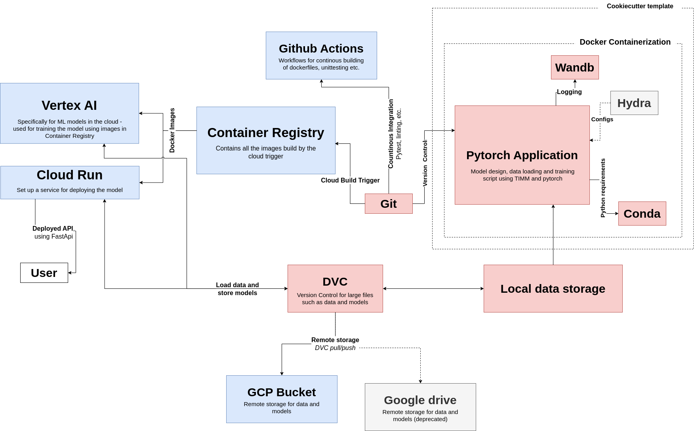

# Exam template for 02476 Machine Learning Operations

This is the report template for the exam. Please only remove the text formatted as with three dashes in front and behind
like:

```--- question 1 fill here ---```

where you instead should add your answers. Any other changes may have unwanted consequences when your report is auto
generated in the end of the course. For questions where you are asked to include images, start by adding the image to
the `figures` subfolder (please only use `.png`, `.jpg` or `.jpeg`) and then add the following code in your answer:

```markdown

```

In addition to this markdown file, we also provide the `report.py` script that provides two utility functions:

Running:

```bash
python report.py html
```

will generate an `.html` page of your report. After deadline for answering this template, we will autoscrape
everything in this `reports` folder and then use this utility to generate an `.html` page that will be your serve
as your final handin.

Running

```bash
python report.py check
```

will check your answers in this template against the constrains listed for each question e.g. is your answer too
short, too long, have you included an image when asked to.

For both functions to work it is important that you do not rename anything. The script have two dependencies that can
be installed with `pip install click markdown`.

## Overall project checklist

The checklist is *exhaustic* which means that it includes everything that you could possible do on the project in
relation the curricilum in this course. Therefore, we do not expect at all that you have checked of all boxes at the
end of the project.

### Week 1

* [x] Create a git repository
* [x] Make sure that all team members have write access to the github repository
* [x] Create a dedicated environment for you project to keep track of your packages
* [x] Create the initial file structure using cookiecutter
* [x] Fill out the `make_dataset.py` file such that it downloads whatever data you need and
* [x] Add a model file and a training script and get that running
* [x] Remember to fill out the `requirements.txt` file with whatever dependencies that you are using
* [x] Remember to comply with good coding practices (`pep8`) while doing the project
* [x] Do a bit of code typing and remember to document essential parts of your code
* [x] Setup version control for your data or part of your data
* [x] Construct one or multiple docker files for your code
* [x] Build the docker files locally and make sure they work as intended
* [x] Write one or multiple configurations files for your experiments
* [x] Used Hydra to load the configurations and manage your hyperparameters
* [ ] When you have something that works somewhat, remember at some point to to some profiling and see if
      you can optimize your code
* [x] Use Weights & Biases to log training progress and other important metrics/artifacts in your code. Additionally,
      consider running a hyperparameter optimization sweep.
* [ ] Use Pytorch-lightning (if applicable) to reduce the amount of boilerplate in your code

### Week 2

* [x] Write unit tests related to the data part of your code
* [ ] Write unit tests related to model construction and or model training
* [x] Calculate the coverage.
* [x] Get some continuous integration running on the github repository
* [x] Create a data storage in GCP Bucket for you data and preferable link this with your data version control setup
* [x] Create a trigger workflow for automatically building your docker images
* [x] Get your model training in GCP using either the Engine or Vertex AI
* [x] Create a FastAPI application that can do inference using your model
* [ ] If applicable, consider deploying the model locally using torchserve
* [x] Deploy your model in GCP using either Functions or Run as the backend

### Week 3

* [ ] Check how robust your model is towards data drifting
* [x] Setup monitoring for the system telemetry of your deployed model
* [ ] Setup monitoring for the performance of your deployed model
* [x] If applicable, play around with distributed data loading
* [ ] If applicable, play around with distributed model training
* [ ] Play around with quantization, compilation and pruning for you trained models to increase inference speed

### Additional

* [x] Revisit your initial project description. Did the project turn out as you wanted?
* [x] Make sure all group members have a understanding about all parts of the project
* [x] Uploaded all your code to github

## Group information

### Question 1
> **Enter the group number you signed up on <learn.inside.dtu.dk>**
>
> Answer:

48

### Question 2
> **Enter the study number for each member in the group**
>
> Example:
>
> *sXXXXXX, sXXXXXX, sXXXXXX*
>
> Answer:

s194354, s153189, s231733

### Question 3
> **What framework did you choose to work with and did it help you complete the project?**
>
> Answer length: 100-200 words.
>
> Example:
> *We used the third-party framework ... in our project. We used functionality ... and functionality ... from the*
> *package to do ... and ... in our project*.
>
> Answer:

We chose to work with the third-party framework Pytorch Image Models (TIMM) as this framework is well suited for image classification. The framework contains various advanced and well-performing neural networks with pretrained weights. Using this therefore enabled us to quickly have a functional model. From the framework we specifically used the pretrained ResNet18 as our machine learning model, along with their integration of Weights and Biases into the training of the network. Aside from TIMM we of course also used a lot of other frameworks, as we were instructed to in the course. These frameworks include (but are not limited to): Terminal, CookieCutter, DVC, Docker and Weights and Biases.


## Coding environment

> In the following section we are interested in learning more about you local development environment.

### Question 4

> **Explain how you managed dependencies in your project? Explain the process a new team member would have to go**
> **through to get an exact copy of your environment.**
>
> Answer length: 100-200 words
>
> Example:
> *We used ... for managing our dependencies. The list of dependencies was auto-generated using ... . To get a*
> *complete copy of our development environment, one would have to run the following commands*
>
> Answer:

For managing our dependencies we relied on manually updating the requirements.txt file. Another option would be to use the built-in pip-command "pip freeze > requirements.txt", however we did not really use this. For a new team member to get an exact copy of the environment needed to run the project, they would have to clone the git repository, run ‘make create_environment’ and activate this new environment. They can then run ‘make requirements’, ‘make dev_requirements’ and lastly ‘make data’. After this they would be able to work on the project with the same environment as the other team members. 

### Question 5

> **We expect that you initialized your project using the cookiecutter template. Explain the overall structure of your**
> **code. Did you fill out every folder or only a subset?**
>
> Answer length: 100-200 words
>
> Example:
> *From the cookiecutter template we have filled out the ... , ... and ... folder. We have removed the ... folder*
> *because we did not use any ... in our project. We have added an ... folder that contains ... for running our*
> *experiments.*
> Answer:

As seen in the top-level README, we used the cookiecutter template for the project. From the MLOps template we have used the data folder (with subfolders "raw" and "processed") and filled out the tests and reports folders. In the <Project name> folder we have filled out the data and models subfolders. We did not use any notebooks in our project, and therefore this folder was removed. Additionally we have included a .dvc folder for the dvc setup, a .github/workflows folder for the automatic testing, a dockerfiles folder for the docker setup and a cloud_config folder.

### Question 6

> **Did you implement any rules for code quality and format? Additionally, explain with your own words why these**
> **concepts matters in larger projects.**
>
> Answer length: 50-100 words.
>
> Answer:

To ensure consistent formatting of the code we used ruff on the project. We also implemented ruff in the pre-compilation actions. Both for our own respective sakes and the sake of our group as a unit, we have tried to document the code adequately in order for each of us to quickly be able to understand what is happening in a particular section of code. This is especially important in larger projects with large teams of developers and for projects which run for long periods of time, as the person who originally wrote a section of code might not be involved with the project at all. This also goes for typing, which can be quite helpful for functions. Also, we have set up a pre-commit hook, with additional checks, to prevent any divergence from the formatting standard even before committing the code to the repository. The pre-commit check is also part of the code-check pipeline.


## Version control

> In the following section we are interested in how version control was used in your project during development to
> corporate and increase the quality of your code.

### Question 7

> **How many tests did you implement and what are they testing in your code?**
>
> Answer length: 50-100 words.
>
> Example:
> *In total we have implemented X tests. Primarily we are testing ... and ... as these the most critical parts of our*
> *application but also ... .*
>
> Answer:

Since we used the pre-made models from the TIMM framework, we did not find it necessary to test the model construction. Therefore we have only made unit tests for the data, as this was the area we deemed the most sensitive. For testing the data we have two tests: one for the raw data (number of images and folders, correct .csv files) and one for the dataloader (checking if we have the appropriate .csv files in the correct folders and checking the folder structure in the processed data folder as needed for the TIMM models). Since we imported an already well-tested model, we decided not to spend too much time and resources on writing unit tests for the models.

### Question 8

> **What is the total code coverage (in percentage) of your code? If you code had an code coverage of 100% (or close**
> **to), would you still trust it to be error free? Explain you reasoning.**
>
> Answer length: 100-200 words.
>
> Example:
> *The total code coverage of code is X%, which includes all our source code. We are far from 100% coverage of our **
> *code and even if we were then...*
>
> Answer:

When we run the command to test the code coverage, we get a result of 100%. This is incorrect, since we only test the data. Since total coverage has not been the main focus of this project, we chose not to investigate this further in an attempt to also have time to do the model deployment.

However, even if it were true that we had a code coverage of 100% (or close to it) this really only means that all of our code is run when we run the tests. There can still be errors in the code, which are simply not caught by the tests.


### Question 9

> **Did you workflow include using branches and pull requests? If yes, explain how. If not, explain how branches and**
> **pull request can help improve version control.**
>
> Answer length: 100-200 words.
>
> Example:
> *We made use of both branches and PRs in our project. In our group, each member had an branch that they worked on in*
> *addition to the main branch. To merge code we ...*
>
> Answer:

Our workflow included personal branches named after which part of the project we were working on. Changes were then committed to the local branch (after going through a pre-commit), and pushed to the corresponding remote branch before we created a pull request. This pull-request went through tests on GitHub and required one additional group member (other than the one creating the pull request) to approve the request before it could be merged into the main branch. This worked well to ensure that no one could merge a pull request directly on to main without making sure everything worked first. This way we were able to make sure that there were no breakdowns on the main branch. After a merge we would then make sure to delete the branch.

### Question 10

> **Did you use DVC for managing data in your project? If yes, then how did it improve your project to have version**
> **control of your data. If no, explain a case where it would be beneficial to have version control of your data.**
>
> Answer length: 100-200 words.
>
> Example:
> *We did make use of DVC in the following way: ... . In the end it helped us in ... for controlling ... part of our*
> *pipeline*
>
> Answer:

We did set up DVC for our raw data, although we did not utilize the version control functionality much, since no changes were made to the raw data. Initially we used Google Drive as the remote storage, but for the later steps of the project, we also employed a GCP bucket. 

Since the ability to store big files in git repositories is limited (and also frowned upon), the raw data normally has to be downloaded from someplace else and placed in the correct folder, when setting up a new instance of the project. Having the raw data tracked using DVC enables us to store the raw data in one place, and once the repository has been cloned, all the user has to do in order to import the data to the correct directory, is to do `dvc pull`, which is very convenient. However, since we did not change this data, DVC was somewhat under-utilized, as the main appeal of DVC is specifically to do version control. In addition to that, the authentication required to use Google Drive as remote storage, did introduce some added complexity to the later parts of the project, for example when running docker containers before the GCP part was set up. Since this project was made on such a limited timeline, this added complexity was costly in the form of hours spent on this. However, DVC was very useful once we got rid of Google Drive. 
DVC lets us store pointers to any large artifact files, not just data files, and so when using Vertex AI the models produced could be handled that way too.

### Question 11

> **Discuss you continues integration setup. What kind of CI are you running (unittesting, linting, etc.)? Do you test**
> **multiple operating systems, python version etc. Do you make use of caching? Feel free to insert a link to one of**
> **your github actions workflow.**
>
> Answer length: 200-300 words.
>
> Example:
> *We have organized our CI into 3 separate files: one for doing ..., one for running ... testing and one for running*
> *... . In particular for our ..., we used ... .An example of a triggered workflow can be seen here: <weblink>*
>
> Answer:

Our CI using GitHub actions has been organized in 3 separate files; one makes use of ruff to check that we comply with PEP8, one is responsible for running the unittests related to the data, and one is for automatically building the docker image for training. Ideally, we would have implemented more unittests to also cover model construction and model training, but since we were pressed for time, we settled for testing the data only in this workflow. This workflow can be seen [here](https://github.com/linneahj/02476_Leaf_Shapes/blob/master/.github/workflows/tests.yml). Since this workflow handles the processing of data and precedes the solutions implemented in GCP, it requires authentication to Google Drive, where the raw data was stored originally. This is handled by GitHub secrets, which for personal repositories can only be setup by the owner of the repository. We learned this the hard way,  when one of us was sick.  
The workflow for triggering the building of a docker image is setup in a similar manner and can be seen [here](https://github.com/linneahj/02476_Leaf_Shapes/blob/master/.github/workflows/train_docker_build.yml). This workflow was deprecated once we started storing docker images in the Container Registry in the cloud, but we kept it up to demonstrate the functionality implemented using Github Actions.
All github workflows run on ubuntu, and are triggered by pull requests to master/main. The master branch is protected, so although the workflow also triggers when pushing to it, the trigger should always be the pull request. In an ideal world, we would have liked to also employ other operating systems, in order to test that our workflow works independently of which operating system is used. We attempted to make use of caching, in order to not have to download the same packages over and over again,  but ended up removing it, as it didn’t function as well as we had hoped.
Lastly, we also have a continuous container build handled by Google Cloud Build, which builds both the API image and the training image - this is further elaborated on in Question 17 and onwards in the section about working in the cloud.

## Running code and tracking experiments

> In the following section we are interested in learning more about the experimental setup for running your code and
> especially the reproducibility of your experiments.

### Question 12

> **How did you configure experiments? Did you make use of config files? Explain with coding examples of how you would**
> **run a experiment.**
>
> Answer length: 50-100 words.
>
> Example:
> *We used a simple argparser, that worked in the following way: python my_script.py --lr 1e-3 --batch_size 25*
>
> Answer:

We used the training script provided by the TIMM framework, which according to the [official docs](https://huggingface.co/docs/timm/main/en/training_script) has “a variety of training args”. These include number of epochs, input image size, number of classes to predict and whether to use wandb for logging. This means that training can be easily configured using for example `python leaf_shapes/train_model.py ./data/processed/TIMM/ --model resnet18 --num-classes 99 --epochs 10  --img-size 64 -–log-wandb` to train a model for 10 epochs with Weights and Biases logging enabled. 
The most used version of this is hardcoded in the makefile, such that calling `make train` will result in both the making of training data and subsequently training a resnet18 model on it. 
For the data, we did set up hydra as well, though it since became obsolete for the training, so it would probably have been nicer to just use a simple argparser for `make_data.py` as well instead, as that would have enabled us to streamline the make-file better.

### Question 13

> **Reproducibility of experiments are important. Related to the last question, how did you secure that no information**
> **is lost when running experiments and that your experiments are reproducible?**
>
> Answer length: 100-200 words.
>
> Example:
> *We made use of config files. Whenever an experiment is run the following happens: ... . To reproduce an experiment*
> *one would have to do ...*
>
> Answer:

Since we used the training script provided by the TIMM framework, the training script automatically saved both it’s corresponding config-file and a log of training loss, evaluation loss, learning rate etc. for each epoch, together with checkpoints of the model during the last couple of epochs, as well as the current best performing model.  This is very useful, since it enables us to see exactly which hyperparameters our model was trained with. In order to reproduce an experiment, the parameters from the config-file can then be set to exactly the same. In an ideal world, the training script should be able to take the entire config-file as an argument, to make it even easier to repeat an experiment, but we did not have time to look up how to do that using TIMM. 
In order to save as much information as possible, we also used Weights and Biases for logging, and in addition to logging training loss, validation loss etc, it also saves a requirement file with all packages needed to rerun the experiment, as well as a yaml-file with the corresponding conda environment.
It would have been nice to also save the configuration of the data processor (which in practice just meant the size the images were resized to, which could also be seen from the size of the model), but this information was also saved both by Weights and Biases and by TIMM, so the most elegant solution would probably be to not use hydra at all.

### Question 14

> **Upload 1 to 3 screenshots that show the experiments that you have done in W&B (or another experiment tracking**
> **service of your choice). This may include loss graphs, logged images, hyperparameter sweeps etc. You can take**
> **inspiration from [this figure](figures/wandb.png). Explain what metrics you are tracking and why they are**
> **important.**
>
> Answer length: 200-300 words + 1 to 3 screenshots.
>
> Example:
> *As seen in the first image when have tracked ... and ... which both inform us about ... in our experiments.*
> *As seen in the second image we are also tracking ... and ...*
>
> Answer:

A staple in graphs to be logged in machine learning is the loss graph, as can be seen in the image below. Logging loss is important, as that shows us how well the model is learning. When also taking the validation loss into account, we can also use the graph to look for signs of overfitting. 



Another example of logged data specific to this project is the learning rate. Since we are using a TIMM resnet18 model which we haven’t spent much time optimizing, we have kept the standard configuration for the learning rate. The learning rate is therefore not static, but uses both a decay rate for the learning rate and a warm-up learning rate. Having never used a non-static learning rate before, it is therefore also relevant to track the learning rate. 



In general, many different metrics can be relevant for the project, depending on the goal of the project. Our project for example logs both validation accuracy for the target matching the models top 1 prediction and for target matching one of the top 5 most likely species. Our data set includes subspecies such as Tilia Oliveri and Tilia Platyphyllos, so accuracy for the top 5 may be relevant, if the model for example has trouble telling subspecies apart, but still chooses correctly within the broader category. 
Apart from hyperparameters and metrics such as accuracy being worth tracking, Weights and Biases also offers support to track system variables. If for example our model is so big, it requires downsampling of the images to run on our GPU, it would be relevant to track RAM usage for the training of our model. This could also be relevant, if we needed to know what it would require to train the model on another machine. 
The image below shows an example of a Weights and Biases report made during the project.



### Question 15

> **Docker is an important tool for creating containerized applications. Explain how you used docker in your**
> **experiments? Include how you would run your docker images and include a link to one of your docker files.**
>
> Answer length: 100-200 words.
>
> Example:
> *For our project we developed several images: one for training, inference and deployment. For example to run the*
> *training docker image: `docker run trainer:latest lr=1e-3 batch_size=64`. Link to docker file: <weblink>*
>
> Answer:

The creation of a docker image for model training is included in the CI workflow, and enables us to train models using our default hyper-parameters in a docker container instead of setting up an environment, which makes the training reproducible. The docker file for the training can be found [here](https://github.com/linneahj/02476_Leaf_Shapes/blob/master/dockerfiles/train_model.dockerfile)  and can be built to an image using `docker build -f dockerfiles/train_model.dockerfile . -t trainer_docker:latest` (or it can be pulled from dockerhub using ` docker pull linneahj/02476_leaf_project:<tag for latest build>` or from gcp using `docker pull gcr.io/leaf-shapes-02476/train`). Once the image has been created, it can be run as a container using `docker run --name experiment1 trainer_docker:latest`. 
When we were using Google Drive instead of GCP Buckets, authentication was needed to run the container (we just saved the authentication as an environment variable using the `-e` flag in the `docker run` command), but using data storage in Google Cloud makes the above command much simpler.
We also have a docker file for the API [here](https://github.com/linneahj/02476_Leaf_Shapes/blob/master/dockerfiles/model_api.dockerfile). Since the image contains a copy of an already trained model, this means the "prediction app" can be launched ready for use simply by running the container, and it is also the basis for cloud deployment of the model.

### Question 16

> **When running into bugs while trying to run your experiments, how did you perform debugging? Additionally, did you**
> **try to profile your code or do you think it is already perfect?**
>
> Answer length: 100-200 words.
>
> Example:
> *Debugging method was dependent on group member. Some just used ... and others used ... . We did a single profiling*
> *run of our main code at some point that showed ...*
>
> Answer:


Debugging was performed in various ways. The old school print statement was often used, and on occasion also the built- in debugger in VS Code. Often the starting point would be the error message and then working backwards from there, reading the documentation of TIMM or Docker or whatever framework was giving us trouble. We unfortunately did not have time to do any profiling of our code, but this could likely have improved upon our code.

## Working in the cloud

> In the following section we would like to know more about your experience when developing in the cloud.

### Question 17

> **List all the GCP services that you made use of in your project and shortly explain what each service does?**
>
> Answer length: 50-200 words.
>
> Example:
> *We used the following two services: Engine and Bucket. Engine is used for... and Bucket is used for...*
>
> Answer:

* **Cloud Build**: used for the automatic building of docker images in the cloud environment. builds are triggered by push in the master branch.
* **Container registry**: used for storing the versions of docker builds in the cloud, allows for run of the built containers in various cloud environments (Cloud Run, Vertex AI, etc.)
* **Cloud Storage**: Cloud Storage Bucket is the main remote data repository for the project. All data versioned by DVC are stored in the project bucket.
* **Vertex AI**: used for running the training experiments. More specifically, a custom run is employed to spin a new VM, run the experiment docker image, store the output data and shut down the VM after the experiment is finished.
* **Cloud Run**: used for deployment of the final model. Deployment is automatically triggered by a push into the master branch.
* **Cloud monitoring**: used to visualize logs and errors from various cloud services

### Question 18

> **The backbone of GCP is the Compute engine. Explained how you made use of this service and what type of VMs**
> **you used?**
>
> Answer length: 100-200 words.
>
> Example:
> *We used the compute engine to run our ... . We used instances with the following hardware: ... and we started the*
> *using a custom container: ...*
>
> Answer:

We have not opted to use the Compute engine. All our cloud training happens through the Vertex AI service. Vertex AI spins up the VM automatically, runs the training script, copies the output data to the cloud storage and shuts down the machine when the run is over. Configuration of the training run can be found in the file `cloud_config/train_config_cpu.yaml`. The run uses configuration *n1-highmem-2*, which allows for higher memory usage than with the default setup. The training process can be started by invoking `make train_cloud`, assuming image *eu.gcr.io/leaf-shapes-02476/train* is present in the cloud repository. The image is built automatically on a push to the master branch.

### Question 19

> **Insert 1-2 images of your GCP bucket, such that we can see what data you have stored in it.**
> **You can take inspiration from [this figure](figures/bucket.png).**
>
> Answer:




### Question 20

> **Upload one image of your GCP container registry, such that we can see the different images that you have stored.**
> **You can take inspiration from [this figure](figures/registry.png).**
>
> Answer:

Our GCP container registry is shown here: 


### Question 21

> **Upload one image of your GCP cloud build history, so we can see the history of the images that have been build in**
> **your project. You can take inspiration from [this figure](figures/build.png).**
>
> Answer:



### Question 22

> **Did you manage to deploy your model, either in locally or cloud? If not, describe why. If yes, describe how and**
> **preferably how you invoke your deployed service?**
>
> Answer length: 100-200 words.
>
> Example:
> *For deployment we wrapped our model into application using ... . We first tried locally serving the model, which*
> *worked. Afterwards we deployed it in the cloud, using ... . To invoke the service an user would call*
> *`curl -X POST -F "file=@file.json"<weburl>`*
>
> Answer:

The project implements a full CI/CD pipeline. We have created a FastAPI app, which performs inference upon posted images. This app can be invoked by `make run_api`, which will start to listen on port 8080. At first we used the *uvicorn* app for the API serving, but this framework kept freezing late on in the cloud environment for unknown reasons. Thus we opted for the *gunicorn* app, which is the recommended solution for usage in production. The API can be containerized by running the script *dockerfiles/model_api.dockerfile* for example by `docker build -f dockerfiles/model_api.dockerfile . -t api:latest`. This build happens automatically in the cloud upon a push to the master branch. Part of the automatic pipeline is also deployment of the built image as a cloud service. Manual deployment to the cloud can be done by using the command: 
`gcloud run deploy api --image eu.gcr.io/leaf-shapes-02476/api --platform managed --region europe-west1 --allow-unauthenticated --memory 4G`.

### Question 23

> **Did you manage to implement monitoring of your deployed model? If yes, explain how it works. If not, explain how**
> **monitoring would help the longevity of your application.**
>
> Answer length: 100-200 words.
>
> Example:
> *We did not manage to implement monitoring. We would like to have monitoring implemented such that over time we could*
> *measure ... and ... that would inform us about this ... behaviour of our application.*
>
> Answer:

We are able to monitor the deployed API app in the long run via Google Cloud Monitoring. We are therefore informed about metrics like Request count, Request latencies, Container instance count, 
Billable container instance time, Container CPU utilization, Container memory utilization, Container startup latency, etc. This enables us to react to possible unexpected events and adapt to those. 

We have, however, not managed to set up custom monitoring metrics, though so far, we do not see which other metric could be beneficial for our use case. Our deployed setup does not account for monitoring  of various data-related skews and drifts, which should be implemented in order to ensure model sustainability in the long run.

### Question 24

> **How many credits did you end up using during the project and what service was most expensive?**
>
> Answer length: 25-100 words.
>
> Example:
> *Group member 1 used ..., Group member 2 used ..., in total ... credits was spend during development. The service*
> *costing the most was ... due to ...*
>
> Answer:

We were using one shared cloud project. Most of the costs are caused by automatic scripts triggered by the repository pushes, therefore we do not think it is possible to divide the costs between the group members.
In total 1.56 USD was spent during development. The most expensive service was Cloud Storage. We have found out that all of the data transfers even inside Google Cloud are charged per GB. For example, one GB of data is transferred between Google Cloud and the internet (used during local `dvc pull`) at a charge of  $0.12. So we have to conclude that we don't see the real advantage of this solution, because it is bound to become really expensive on a larger scale.




## Overall discussion of project

> In the following section we would like you to think about the general structure of your project.

### Question 25

> **Include a figure that describes the overall architecture of your system and what services that you make use of.**
> **You can take inspiration from [this figure](figures/overview.png). Additionally in your own words, explain the**
> **overall steps in figure.**
>
> Answer length: 200-400 words
>
> Example:
>
> *The starting point of the diagram is our local setup, where we integrated ... and ... and ... into our code.*
> *Whenever we commit code and puch to github, it auto triggers ... and ... . From there the diagram shows ...*
>
> Answer:

An overview of the different components of this project is shown in the image below. Blue signifies cloud, red for local, and grey shows the functionality was deprecated during the project, but still used in the process.



As this figure shows, the starting point of the project is a Pytorch application, which utilizes TIMM. This application was initialized using a cookiecutter template, and it is containerized using docker. It utilizes W&B for logging, and Hydra for some configuration (although this was deprecated later in the process). The project is version controlled using git and the data is version controlled using dvc. Continuous Integration was done using both Github Actions for unittest, good coding practices and the initial continuous container-building and triggers in the Cloud Build for the final continuous container building. These containers are then stored in the Container Registry (soon to be replaced with Artifact Registry), and from there the images can be used to train models using Vertex AI, which can then be stored along with the data in a GCP Bucket. The docker images in the registry are also used for the deployment of the model using Cloud Run, creating the API for the model, such that it can be readily used by the end-user.


### Question 26

> **Discuss the overall struggles of the project. Where did you spend most time and what did you do to overcome these**
> **challenges?**
>
> Answer length: 200-400 words.
>
> Example:
> *The biggest challenges in the project was using ... tool to do ... . The reason for this was ...*
>
> Answer:

There were many struggles in this project. We got off to a rocky start, as we were too ambitious and the data set and model we initially chose turned out to be too big to run locally on our PCs, and so we had to start over from scratch. The main source of frustration however was GCP, where many, many hours were spent in vain trying to manage authorization, before a solution was found. Specifically we learned, that the accounts that need to manipulate the bucket should have the Storage Object Admin permission, and not the Storage Legacy Bucket Owner permission, as the course website showed. We also learned that when deloying the model using Cloud Run, the container has to listen on the adress 0.0.0.0:8080, which is not clearly stated in the documentation (or the course website). Docker also introduced some troubles, especially with the authentication-issues. For this, the internet was a great help, although many hours still were spent with not much progress to show. We also had a bug resulting in models of the wrong size, which was very hard to pin down, as none of the usual debug tools were of much help there. DVC was another very timeconsuming troublemaker, where we ultimately overcame many of the troubles by simply starting over again and redoing dvc-init. Overall the time spent on this project way exeeded the alloted timeslots and resulted in more than one sleepless night.

Additionally, on a more practical level, illness meant at least one of us was off sick almost every project day, with first one person falling sick, then another, making the workload even bigger. Overall, the motto of this project has been “Slow Progress!”

### Question 27

> **State the individual contributions of each team member. This is required information from DTU, because we need to**
> **make sure all members contributed actively to the project**
>
> Answer length: 50-200 words.
>
> Example:
> *Student sXXXXXX was in charge of developing of setting up the initial cookie cutter project and developing of the*
> *docker containers for training our applications.*
> *Student sXXXXXX was in charge of training our models in the cloud and deploying them afterwards.*
> *All members contributed to code by...*
>
> Answer:

For the initial build of the project, students s153189 and s194354 set up the GitHub repository with the cookiecutter template and set up data version control using Google Drive, along with creating the make_dataset.py script.
Student s153189 was in charge of creating a training script using the TIMM framework and developing the docker container for the project, the API for local use and most of the github workflows for the CI.
Student s194354 was in charge of the testing and hydra configuration.
Student s231733 was in charge of all things related to GCP and for setting up the remaining parts of CI.

Through all of the project we used each other for sparring and input, and everyone has been involved with every aspect of the code. The report was answered by all team members in equal measure.

